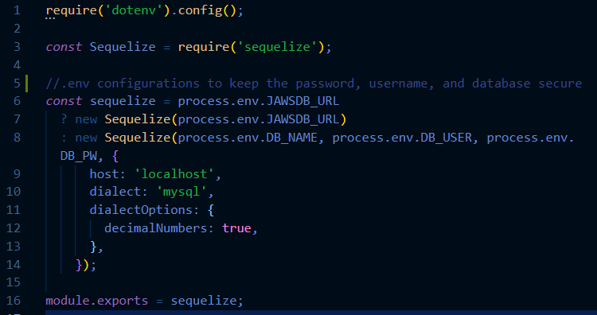
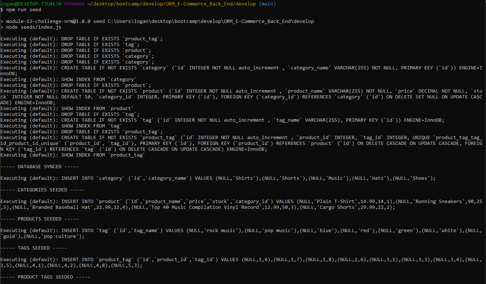
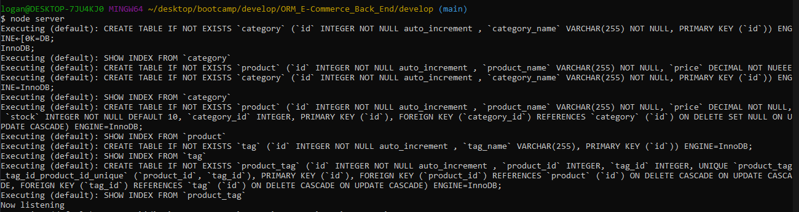

## Challenge Thirteen ORME-Commerce_Back_End

### Description

For this challenge, we were tasked with building the back end of a Commerce site using Sequalize in place the previous SQL queries that were hardcoded in. This involved building out the Models for Categories, Products, and Tags, setting up the appropriate Foreign Key relationships and which Model belongs to which in the index.js file within the models folder.

Likewise the API routes were written using Sequalize parlance for the appropriate GET/PUT/POST/DELETE request. Those being .findAll, .findOne, .update, and .delete respectively. Those API routes were then tested in Insomnia with existing seeded data. The result of which can be viewed in the linked video.

### Screenshots

To store your password, username, and database in a secure fashion, make sure you install dotenv using *npm install dotenv*, and have the following require statment, and appropriate declarations, storing that data in a separate .env file

To setup the database, make sure you sign into youe MySQL shell using your password and run the following command *source db/schema.sql* 

Next, to seed the database, type *npm run seed* into the command line and you will get the following result

Finally, to start the server to begin testing with Insomnia or another API platform, type *node server* into the command line

You should now be able to test your API endpoints on the platform using your localhost port!

### Links

Github: [Link](https://github.com/LoganDufek/ORM_E-Commerce_Back_End)
YouTube:[Link](https://www.youtube.com/watch?v=Pgmt25ofqk8)